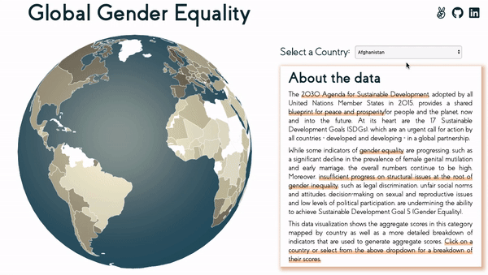
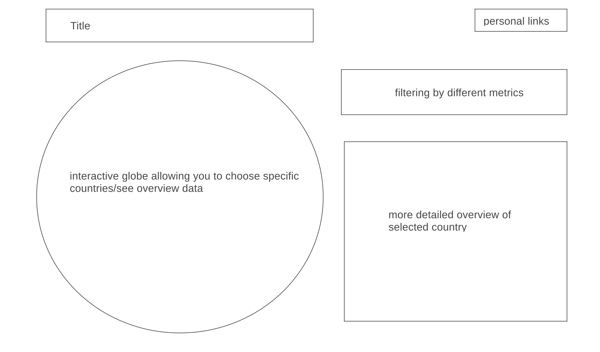

# Global-Gender-Equality

## Background and Overview

Global Gender Equality is a data visualization showing how different countries globally stack up in regards to gender equality. The visualization will feature an interactive globe that allows you to focus in on individual countries and gain insight on how they perform in certain metrics for gender equality, as well as show an aggregate view from a zoomed-out perspective for comparison between different countries.

## Functionality

* Will feature an interactive 3D globe that rotates when no country is selected
* Users will be able to click on/select a country and get more data for  that specific country
* Users will be able to filter by different equality metrics as well as look at an aggregate score

## MVPs

* 3D interactive globe
* Assembling data 
* Implementing way to look at data globally (color scales)
* Implementing click/select to get more detailed look at data for one country

## Wireframe

## Technologies

* Javascript
* webpack
* D3
* D3 Geojson
* HTML5
* SVG

## Bonus

* Add historical data to show progression over time
* More thorough breakdown of the US specifically
* Allow for further filtering by other categories such as age groups, income brackets, race, etc.
